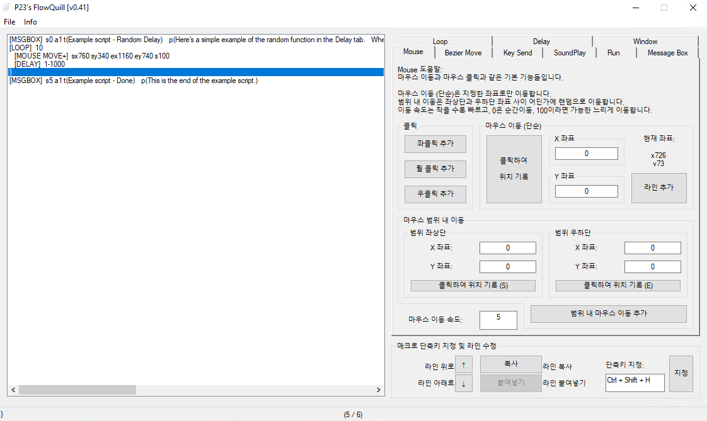

# P23's FlowQuill
DSL 인터프리터에 GUI를 결합한 자동화 스크립팅 툴입니다.

지루한 단순 반복 작업들을 자동화하는 간단한 스크립트를 제작/실행할 수 있습니다.

일반 사용자시라면, 여기 [Releases](https://github.com/PPPurple23/P23s_FlowQuill/releases)에서 Setup 파일을 받으실 수 있습니다.

[example macros](https://github.com/PPPurple23/P23s_FlowQuill/tree/main/example%20macros) 안에는 FlowQuill에 사용 가능한 예제들이 들어있습니다.

(릴리스 버전 셋업으로 설치하면, 프로그램 설치 폴더 내의 examples 폴더에 예제들이 위치해 있습니다.)

## etc
이 리파지토리 내의 스크립트 전체 또는 함수들은 마음대로 수정하여도 좋습니다.

단, 전체 스크립트의 수정 후 재배포는 금지합니다.
